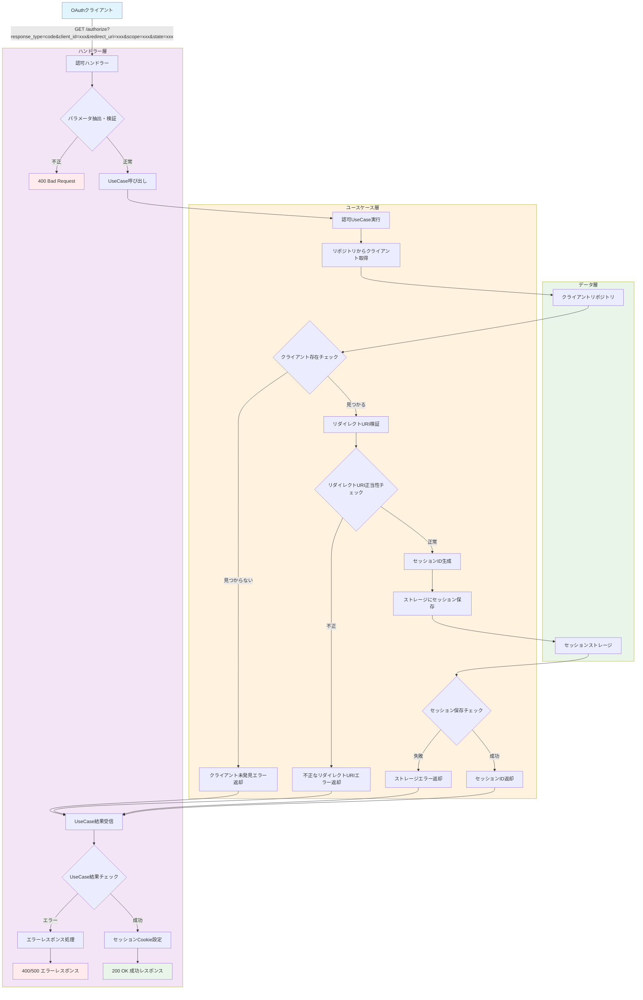

## 認可エンドポイント

```mermaid
flowchart TD
    OAUTH_CLIENT[OAuthクライアント] -->|GET /authorize?response_type=code&client_id=xxx&redirect_uri=xxx&scope=xxx&state=xxx| AUTH_HANDLER[認可ハンドラー]

    AUTH_HANDLER --> EXTRACT_VALIDATE_PARAMS{パラメータ抽出・検証}
    EXTRACT_VALIDATE_PARAMS -->|不正| BAD_REQUEST_RESPONSE[400 Bad Request]
    EXTRACT_VALIDATE_PARAMS -->|正常| CALL_USECASE[UseCase呼び出し]

    CALL_USECASE --> USECASE_EXECUTE[認可UseCase実行]
    USECASE_EXECUTE --> GET_CLIENT_FROM_REPO[リポジトリからクライアント取得]
    GET_CLIENT_FROM_REPO --> CLIENT_REPOSITORY[クライアントリポジトリ]
    CLIENT_REPOSITORY --> CLIENT_EXISTS_CHECK{クライアント存在チェック}

    CLIENT_EXISTS_CHECK -->|見つからない| RETURN_CLIENT_NOT_FOUND[クライアント未発見エラー返却]
    RETURN_CLIENT_NOT_FOUND --> RECEIVE_USECASE_RESULT[UseCase結果受信]

    CLIENT_EXISTS_CHECK -->|見つかる| VALIDATE_REDIRECT_URI[リダイレクトURI検証]
    VALIDATE_REDIRECT_URI --> REDIRECT_URI_VALID_CHECK{リダイレクトURI正当性チェック}
    REDIRECT_URI_VALID_CHECK -->|不正| RETURN_INVALID_REDIRECT_URI[不正なリダイレクトURIエラー返却]
    RETURN_INVALID_REDIRECT_URI --> RECEIVE_USECASE_RESULT

    REDIRECT_URI_VALID_CHECK -->|正常| GENERATE_SESSION_ID[セッションID生成]
    GENERATE_SESSION_ID --> SAVE_SESSION_TO_STORAGE[ストレージにセッション保存]
    SAVE_SESSION_TO_STORAGE --> SESSION_STORAGE[セッションストレージ]
    SESSION_STORAGE --> SESSION_SAVED_CHECK{セッション保存チェック}

    SESSION_SAVED_CHECK -->|失敗| RETURN_STORAGE_ERROR[ストレージエラー返却]
    RETURN_STORAGE_ERROR --> RECEIVE_USECASE_RESULT

    SESSION_SAVED_CHECK -->|成功| RETURN_SESSION_ID[セッションID返却]
    RETURN_SESSION_ID --> RECEIVE_USECASE_RESULT

    RECEIVE_USECASE_RESULT --> CHECK_USECASE_RESULT{UseCase結果チェック}
    CHECK_USECASE_RESULT -->|エラー| HANDLE_ERROR_RESPONSE[エラーレスポンス処理]
    HANDLE_ERROR_RESPONSE --> ERROR_RESPONSE[400/500 エラーレスポンス]

    CHECK_USECASE_RESULT -->|成功| SET_SESSION_COOKIE[セッションCookie設定]
    SET_SESSION_COOKIE --> SUCCESS_RESPONSE[200 OK 成功レスポンス]

	subgraph DB_AREA["データ層"]
        CLIENT_REPOSITORY
        SESSION_STORAGE
    end

    subgraph USECASE_AREA["ユースケース層"]
        USECASE_EXECUTE
        GET_CLIENT_FROM_REPO
        CLIENT_EXISTS_CHECK
        RETURN_CLIENT_NOT_FOUND
        VALIDATE_REDIRECT_URI
        REDIRECT_URI_VALID_CHECK
        RETURN_INVALID_REDIRECT_URI
        GENERATE_SESSION_ID
        SAVE_SESSION_TO_STORAGE
        SESSION_SAVED_CHECK
        RETURN_STORAGE_ERROR
        RETURN_SESSION_ID
    end

	subgraph HANDLER_AREA["ハンドラー層"]
        AUTH_HANDLER
        EXTRACT_VALIDATE_PARAMS
        BAD_REQUEST_RESPONSE
        CALL_USECASE
        RECEIVE_USECASE_RESULT
        CHECK_USECASE_RESULT
        HANDLE_ERROR_RESPONSE
        ERROR_RESPONSE
        SET_SESSION_COOKIE
        SUCCESS_RESPONSE
    end

    style OAUTH_CLIENT fill:#e1f5fe
    style HANDLER_AREA fill:#f3e5f5
    style USECASE_AREA fill:#fff3e0
    style DB_AREA fill:#e8f5e8
    style BAD_REQUEST_RESPONSE fill:#ffebee
    style ERROR_RESPONSE fill:#ffebee
    style SUCCESS_RESPONSE fill:#e8f5e8
```
