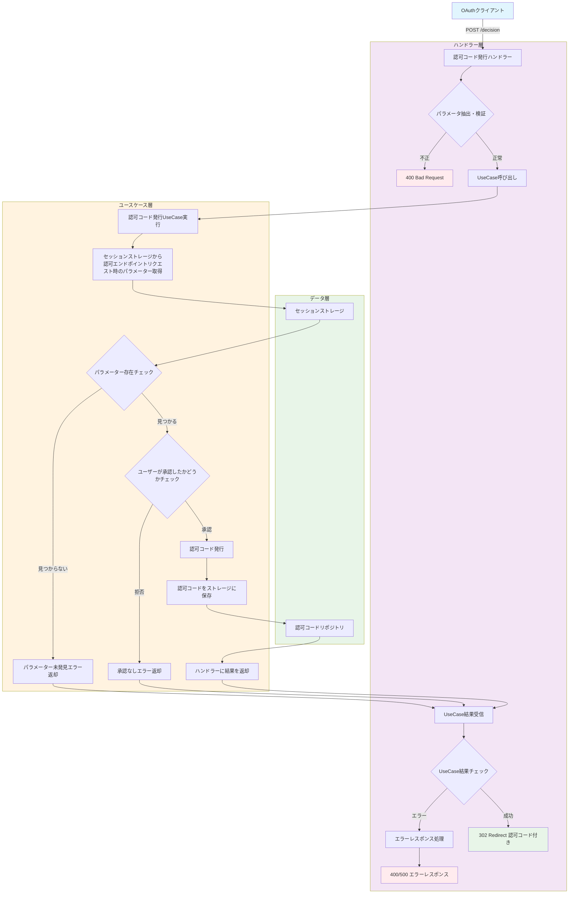

```mermaid
flowchart TD
    OAUTH_CLIENT[OAuthクライアント] -->|POST /decision| AUTH_HANDLER[認可コード発行ハンドラー]

    AUTH_HANDLER --> EXTRACT_VALIDATE_PARAMS{パラメータ抽出・検証}
    EXTRACT_VALIDATE_PARAMS -->|不正| BAD_REQUEST_RESPONSE[400 Bad Request]
    EXTRACT_VALIDATE_PARAMS -->|正常| CALL_USECASE[UseCase呼び出し]


    CALL_USECASE --> USECASE_EXECUTE[認可コード発行UseCase実行]
    USECASE_EXECUTE --> GET_PARAMETER_FROM_SESSION[セッションストレージから認可エンドポイントリクエスト時のパラメーター取得]
    GET_PARAMETER_FROM_SESSION --> SESSION_STORAGE[セッションストレージ]
    SESSION_STORAGE --> PARAMETER_EXISTS_CHECK{パラメーター存在チェック}

    PARAMETER_EXISTS_CHECK -->|見つからない| RETURN_PARAMETER_NOT_FOUND[パラメーター未発見エラー返却]
    RETURN_PARAMETER_NOT_FOUND --> RECEIVE_USECASE_RESULT[UseCase結果受信]
    PARAMETER_EXISTS_CHECK -->|見つかる| CHECK_IS_APPROVED{ユーザーが承認したかどうかチェック}
    CHECK_IS_APPROVED -->|拒否| ERR_NOT_APPROVED[承認なしエラー返却]
    ERR_NOT_APPROVED --> RECEIVE_USECASE_RESULT
    CHECK_IS_APPROVED -->|承認| PUBLISH_AUTHORIZATION_CODE[認可コード発行]
    PUBLISH_AUTHORIZATION_CODE --> SAVE_AUTH_CODE_TO_STORAGE[認可コードをストレージに保存]
    SAVE_AUTH_CODE_TO_STORAGE --> AUTH_CODE_REPOSITORY[認可コードリポジトリ]
    AUTH_CODE_REPOSITORY --> SEND_RESULT_TO_HANDLER[ハンドラーに結果を返却]
    SEND_RESULT_TO_HANDLER --> RECEIVE_USECASE_RESULT

    RECEIVE_USECASE_RESULT --> CHECK_USECASE_RESULT{UseCase結果チェック}
    CHECK_USECASE_RESULT -->|エラー| HANDLE_ERROR_RESPONSE[エラーレスポンス処理]
    HANDLE_ERROR_RESPONSE --> ERROR_RESPONSE[400/500 エラーレスポンス]

    CHECK_USECASE_RESULT -->|成功| REDIRECT_WITH_AUTH_CODE[302 Redirect 認可コード付き]

	HANDLER_AREA~~~USECASE_AREA~~~DB_AREA

    subgraph HANDLER_AREA["ハンドラー層"]
        AUTH_HANDLER
        EXTRACT_VALIDATE_PARAMS
        BAD_REQUEST_RESPONSE
        CALL_USECASE
        RECEIVE_USECASE_RESULT
        CHECK_USECASE_RESULT
        HANDLE_ERROR_RESPONSE
        ERROR_RESPONSE
        REDIRECT_WITH_AUTH_CODE
    end

    subgraph USECASE_AREA["ユースケース層"]
        USECASE_EXECUTE
        CHECK_IS_APPROVED
        ERR_NOT_APPROVED
        GET_PARAMETER_FROM_SESSION
        PARAMETER_EXISTS_CHECK
        RETURN_PARAMETER_NOT_FOUND
        PUBLISH_AUTHORIZATION_CODE
        SAVE_AUTH_CODE_TO_STORAGE
        SEND_RESULT_TO_HANDLER
    end

    subgraph DB_AREA["データ層"]
        SESSION_STORAGE
        AUTH_CODE_REPOSITORY
    end

    style OAUTH_CLIENT fill:#e1f5fe
    style HANDLER_AREA fill:#f3e5f5
    style USECASE_AREA fill:#fff3e0
    style DB_AREA fill:#e8f5e8
    style BAD_REQUEST_RESPONSE fill:#ffebee
    style ERROR_RESPONSE fill:#ffebee
    style REDIRECT_WITH_AUTH_CODE fill:#e8f5e8
```
