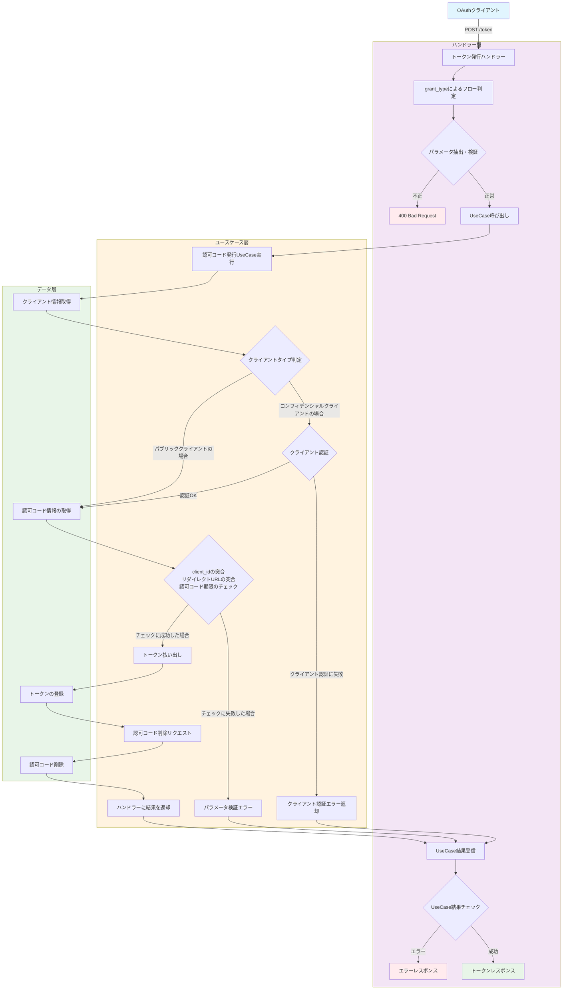

```mermaid
flowchart TD
    %% リクエスト受信
    OAUTH_CLIENT[OAuthクライアント] -->|POST /token| TOKEN_HANDLER -->

    %% フロー判定
    DECIDE_FLOW-->EXTRACT_VALIDATE_PARAMS

    %% パラメータ検証
    EXTRACT_VALIDATE_PARAMS
    EXTRACT_VALIDATE_PARAMS -->|不正| BAD_REQUEST_RESPONSE
    EXTRACT_VALIDATE_PARAMS -->|正常| CALL_USECASE

    %% ユースケース実行
    CALL_USECASE -->
    USECASE_EXECUTE-->
    GET_CLIENT_INFO -->
    CHECK_CLIENT_TYPE

    %% コンフィデンシャルクライアントのみクライアント認証あり
    CHECK_CLIENT_TYPE-->
    |パブリッククライアントの場合| GET_AUTHORIZATION_CODE_INFO

    CHECK_CLIENT_TYPE -->
    |コンフィデンシャルクライアントの場合| CLIENT_AUTHENTICATION

    %% クライアント認証
    CLIENT_AUTHENTICATION -->
    |認証OK| GET_AUTHORIZATION_CODE_INFO

    CLIENT_AUTHENTICATION-->
    |クライアント認証に失敗| RETURN_CLIENT_AUTHENTICATION_ERROR-->RECEIVE_USECASE_RESULT

    %% 認可コード取得〜トークン払い出し
    GET_AUTHORIZATION_CODE_INFO--> RECONCILE_PARAMETERS

    RECONCILE_PARAMETERS -->|チェックに成功した場合| PUBLISH_TOKEN
    RECONCILE_PARAMETERS -->|チェックに失敗した場合| RETURN_PARAMETER_CHECK_ERROR --> RECEIVE_USECASE_RESULT

	PUBLISH_TOKEN -->
    REGISTER_TOKEN-->
    AUTHORIZATION_CODE_DELETE_REQUEST -->
    AUTHORIZATION_CODE_DELETE-->
    SEND_RESULT_TO_HANDLER-->
    RECEIVE_USECASE_RESULT

    %% ハンドラーレスポンス処理
    RECEIVE_USECASE_RESULT -->CHECK_USECASE_RESULT
    CHECK_USECASE_RESULT -->|エラー| ERROR_RESPONSE

    CHECK_USECASE_RESULT -->|成功| RESPONSE

	HANDLER_AREA~~~USECASE_AREA~~~DB_AREA

    subgraph HANDLER_AREA["ハンドラー層"]
        TOKEN_HANDLER[トークン発行ハンドラー]
        DECIDE_FLOW[grant_typeによるフロー判定]
        EXTRACT_VALIDATE_PARAMS{パラメータ抽出・検証}
        BAD_REQUEST_RESPONSE[400 Bad Request]
        CALL_USECASE[UseCase呼び出し]
        RECEIVE_USECASE_RESULT[UseCase結果受信]
        CHECK_USECASE_RESULT{UseCase結果チェック}
        ERROR_RESPONSE[エラーレスポンス]
        RESPONSE[トークンレスポンス]
    end

    subgraph USECASE_AREA["ユースケース層"]
        USECASE_EXECUTE[認可コード発行UseCase実行]
		CHECK_CLIENT_TYPE{クライアントタイプ判定}
		CLIENT_AUTHENTICATION{クライアント認証}
        RETURN_CLIENT_AUTHENTICATION_ERROR[クライアント認証エラー返却]
        RECONCILE_PARAMETERS{
		client_idの突合
	    リダイレクトURLの突合
		認可コード期限のチェック
        }
        RETURN_PARAMETER_CHECK_ERROR[パラメータ検証エラー]
		PUBLISH_TOKEN[トークン払い出し]
        SEND_RESULT_TO_HANDLER[ハンドラーに結果を返却]
		AUTHORIZATION_CODE_DELETE_REQUEST[認可コード削除リクエスト]
    end

    subgraph DB_AREA["データ層"]
        GET_CLIENT_INFO[クライアント情報取得]
        GET_AUTHORIZATION_CODE_INFO[認可コード情報の取得]
		REGISTER_TOKEN[トークンの登録]
		AUTHORIZATION_CODE_DELETE[認可コード削除]
    end

    style OAUTH_CLIENT fill:#e1f5fe
    style HANDLER_AREA fill:#f3e5f5
    style USECASE_AREA fill:#fff3e0
    style DB_AREA fill:#e8f5e8
    style BAD_REQUEST_RESPONSE fill:#ffebee
    style ERROR_RESPONSE fill:#ffebee
    style RESPONSE fill:#e8f5e8
```
