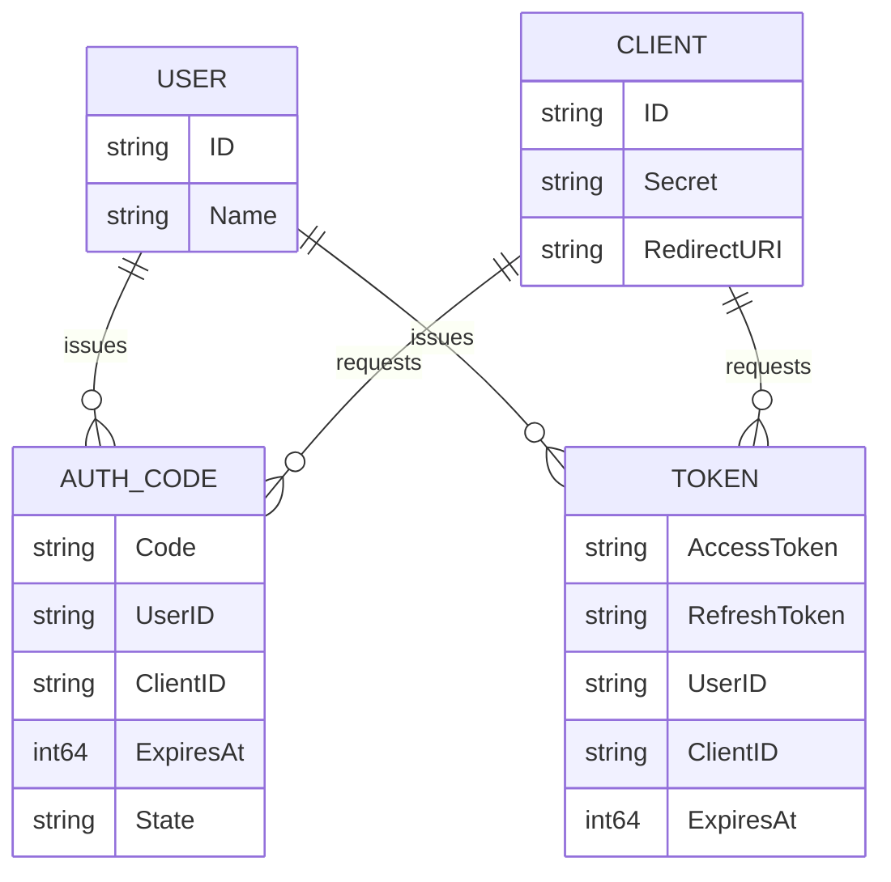

# ER図（簡易版）

```mermaid
erDiagram
    USER ||--o{ AUTH_CODE : issues
    CLIENT ||--o{ AUTH_CODE : requests
    USER ||--o{ TOKEN : issues
    CLIENT ||--o{ TOKEN : requests

    USER {
      string ID
      string Name
    }
    CLIENT {
      string ID
      string Secret
      string RedirectURI
    }
    AUTH_CODE {
      string Code
      string UserID
      string ClientID
      int64 ExpiresAt
      string State
    }
    TOKEN {
      string AccessToken
      string RefreshToken
      string UserID
      string ClientID
      int64 ExpiresAt
    }
```
